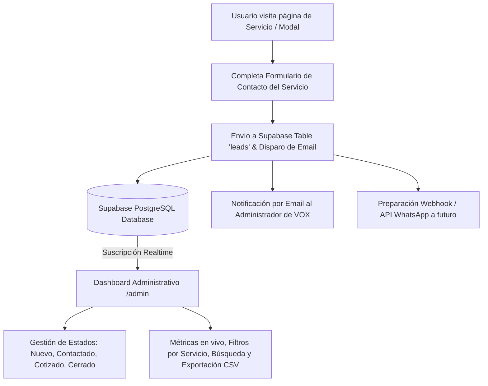

# Plan de Implementación: Sistema de Captación de Leads y Dashboard Administrativo con Supabase (VOX Business Developer)

Este documento detalla la arquitectura técnica, componentes, modelo de base de datos y fases de ejecución para implementar el sistema de captura de prospectos por servicio, almacenamiento seguro en **Supabase** (PostgreSQL, Auth y Realtime), notificaciones por correo electrónico y el nuevo **Dashboard CRM de Administración** para VOX Business Developer.

---

## 1. Resumen Ejecutivo

El objetivo de este desarrollo es convertir cada una de las páginas de servicios de VOX (`branding.html`, `arquitectura.html`, `marketing.html`, `juridico.html`, `contable.html`, etc.) en un canal directo y automatizado de captación de clientes cualificados.

Cada servicio contará con su propio punto de contacto estructurado que:
1. Identifica automáticamente el servicio de procedencia del cliente.
2. Registra los datos del prospecto en una base de datos relacional y segura en la nube (**Supabase**).
3. Envía una notificación instantánea por correo electrónico al equipo comercial de VOX (`HOLA@VOXBUSINESSDEVELOPER.COM`).
4. Alimenta un **Dashboard CRM Administrativo** (`/admin`) en tiempo real donde el equipo puede gestionar estados (*Nuevo*, *En revisión*, *Contactado*, *Cotizado*, *Cerrado*, *Descartado*), agregar notas internas y abrir chats directos de WhatsApp o redactar emails con un solo clic.

---

## 2. Diagrama de Arquitectura



---

## 3. Modelo de Base de Datos (Supabase Schema SQL)

Script SQL optimizado con políticas de seguridad a nivel de fila (**RLS** - Row Level Security):

```sql
-- 1. Crear tabla de leads
create table public.leads (
    id uuid default gen_random_uuid() primary key,
    created_at timestamp with time zone default timezone('utc'::text, now()) not null,
    nombre text not null,
    correo text not null,
    telefono text,
    empresa text,
    servicio text not null,
    presupuesto text,
    mensaje text,
    estado text default 'nuevo' check (estado in ('nuevo', 'en_revision', 'contactado', 'cotizado', 'cerrado', 'descartado')),
    notas text default '',
    origen_url text
);

-- 2. Habilitar Row Level Security (RLS)
alter table public.leads enable row level security;

-- 3. Política de inserción pública (Cualquier visitante puede enviar su solicitud)
create policy "Permitir inserción pública de leads" on public.leads
    for insert with check (true);

-- 4. Política de lectura y gestión exclusiva para usuarios autenticados (Admin de VOX)
create policy "Solo administradores autenticados pueden ver y editar leads" on public.leads
    for all using (auth.role() = 'authenticated');
```

---

## 4. Componentes y Funcionalidades Detalladas

### A. Formulario Inteligente en Cada Servicio (Front-End)
- **Campos incluidos (modelo de muestra expandible):**
  - Nombre completo.
  - Correo electrónico.
  - Teléfono / WhatsApp.
  - Empresa u Organización.
  - Servicio de interés (auto-detectado y preseleccionado).
  - Presupuesto estimado / Rango de inversión.
  - Mensaje / Descripción del requerimiento.
- **Validaciones en tiempo real:** Control de campos obligatorios, formato de email y teléfono con retroalimentación visual (íconos y animaciones).
- **Feedback al usuario:** Animación premium de carga y tarjeta de confirmación de recepción exitosa.

### B. Módulo de Conexión y Servicios (`supabase-config.js` y `lead-service.js`)
- Inicialización centralizada del cliente de Supabase usando el SDK oficial `@supabase/supabase-js`.
- Gestión de guardado en base de datos.
- Despacho paralelo de alertas por correo electrónico.
- Modo *fallback* de prueba (LocalStorage) para funcionamiento offline o mientras se configuran las claves de producción.

### C. Dashboard CRM Administrativo (`/admin`)
- **Seguridad y Acceso:**
  - Login protegido mediante **Supabase Auth** (correo/contraseña).
  - Persistencia de sesión segura y botón de cierre de sesión.
- **Métricas & KPIs en Tiempo Real:**
  - Total de solicitudes recibidas.
  - Leads nuevos pendientes de atención.
  - Distribución gráfica/porcentual de leads por categoría de servicio.
  - Tasa de atención y embudo de conversión.
- **Bandeja de Gestión de Leads:**
  - Actualización en tiempo real vía `supabase.channel('leads')` (los nuevos leads aparecen instantáneamente sin recargar la pantalla).
  - Buscador rápido por nombre, correo o empresa.
  - Filtro por servicio (Branding, Arquitectura, Marketing, Legal, etc.) y por estado.
  - Modal de vista de detalle completo con historial y fecha/hora.
  - Modificación rápida de estado (*Nuevo*, *En revisión*, *Contactado*, *Cotizado*, *Cerrado*, *Descartado*).
  - Bloc de notas internas para cada lead.
  - **Acciones Rápidas:**
    - Botón para abrir chat directo en WhatsApp con mensaje personalizado de contacto.
    - Botón para redactar correo electrónico inmediato.
- **Exportación:**
  - Descarga de la lista completa o filtrada de prospectos en formato CSV / Excel.

### D. Sistema de Notificaciones & Escalabilidad
- **Email:** Disparo de notificación automática a `HOLA@VOXBUSINESSDEVELOPER.COM` con todos los detalles del lead apenas se recibe la solicitud.
- **WhatsApp (Fase 2):** Función modular `sendWhatsAppNotification(leadData)` preparada en el código para conectar con Twilio, Meta Cloud API o Webhooks de automatización.

---

## 5. Estructura de Archivos a Crear y Modificar

```
Pagina web VOX/
├── admin/
│   ├── index.html            # Panel de login y CRM de administración
│   ├── dashboard.css         # Estilos premium oscuros / glassmorphism
│   └── dashboard.js          # Lógica de autenticación, Realtime, KPIs y leads
├── assets/
│   └── js/
│       ├── supabase-config.js # Configuración del cliente Supabase
│       └── lead-service.js    # Manejador unificado de captura, email y base de datos
├── servicios/
│   ├── arquitectura.html     # Integración de formulario contextual
│   ├── branding.html
│   ├── contable.html
│   ├── desarrollo.html
│   ├── interiorismo.html
│   ├── juridico.html
│   ├── marketing.html
│   └── auditorias.html
├── servicio.js               # Conexión del formulario al servicio de leads
├── supabase_schema.sql       # Script SQL para crear tabla y políticas en Supabase
├── IMPLEMENTATION_PLAN_LEADS.md # Este documento de planificación técnica
└── Plan_Implementacion_Dashboard_Leads_VOX.docx # Versión Word para dirección
```

---

## 6. Beneficios para VOX Business Developer

1. **Cero Fuga de Oportunidades:** Ningún cliente potencial se pierde; todo queda registrado y centralizado en la nube.
2. **Velocidad de Respuesta Comercial:** Las alertas inmediatas y el botón de WhatsApp directo reducen el tiempo de primera respuesta a minutos, aumentando significativamente la tasa de conversión.
3. **Métricas Claras para Toma de Decisiones:** Visibilidad transparente sobre qué servicios tienen mayor demanda y mejor retorno.
